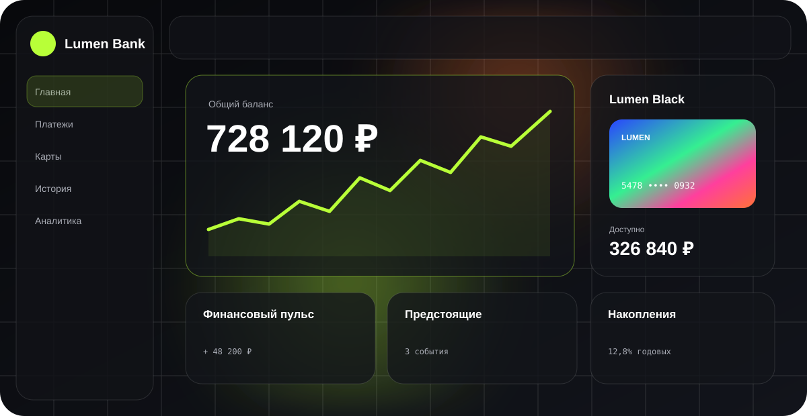
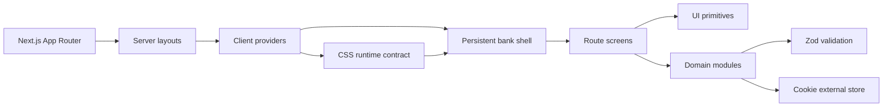

# Lumen Bank

> Адаптивный прототип цифрового банка: полноценные сценарии платежей, переводов и пополнений, отдельные экраны операций, аналитика, карты, настройки, локализация и настраиваемая glass/glow-система.

[](https://nextjs.org/)
[](https://react.dev/)
[](https://bun.sh/)
[](https://www.typescriptlang.org/)
[](#лицензии-зависимостей)



Lumen Bank воспроизводит структуру современного российского банковского приложения, но использует собственную визуальную систему: тёмные и светлые поверхности, стекло, мягкое свечение, компактную информационную плотность и iOS-подобные анимации. Общий layout сохраняется между маршрутами, поэтому переходы выполняются через Next.js App Router без полной перезагрузки документа.

> [!IMPORTANT]
> Это демонстрационный интерфейс. Он не подключён к банковскому backend, не проводит реальные операции и не предназначен для ввода настоящих платёжных или персональных данных.

## Возможности

### Банк и операции

- Главная с балансом, несколькими картами, предложением новой карты, быстрыми действиями, историей, накоплениями и финансовыми виджетами.
- Переводы по телефону, номеру карты и счёту с масками, подсказками получателей, комиссией, расписанием и экраном проверки.
- Пополнение с внешней карты, собственного счёта или через демонстрационный cash-сценарий.
- Оплата связи, интернета, ЖКХ, транспорта, госуслуг, образования, здоровья, подписок и игр с формой под выбранную категорию.
- Уникальный slug для каждой операции, статусы «выполнено», «в обработке» и «отклонено», причина отказа и отдельная квитанция.
- Скачивание демонстрационного чека с progress feedback и безопасное окно шаринга без полных реквизитов.
- Фильтруемая история и аналитика с тематическими графиками.

### Интерфейс

- Светлая и тёмная темы с круговым ripple-переходом из точки нажатия.
- Адаптивный desktop sidebar и округлый мобильный glass dock.
- Закреплённая верхняя панель, командный поиск по `Ctrl/⌘ + K`, уведомления и меню профиля.
- Skeleton-состояния, первичный loader, scroll reveal, направленные переходы между уровнями маршрутов и toast-уведомления.
- Geist Sans для основного интерфейса и Geist Mono для компактных сумм и метаданных.
- Клавиатурный focus, skip-link, live region, крупные touch targets и поддержка `prefers-reduced-motion`.

### Персонализация

- Акцентный цвет, фон, glow, blur, прозрачность стекла, насыщенность, контраст, тени и радиусы.
- Масштаб и плотность интерфейса, скорость анимаций и отдельные easing-функции для маршрутов, панелей, модальных окон и micro-interactions.
- Скрытие баланса, стиль карт, количество демонстрационных карт, системные или заданные дата и время.
- Порядок навигации, быстрых действий, верхней панели и dashboard-блоков.
- Интерактивный редактор компоновки с drag-and-drop и магнитной плавающей панелью.
- Настройки доступности, уведомлений, языка, единиц измерения, безопасности, приватности и доверенных устройств.

### Контент и право

- Публичный лендинг банка, центр поддержки, FAQ и расширенный юридический раздел.
- 10 языков: русский, английский, белорусский, казахский, испанский, китайский, японский, украинский, немецкий и французский.
- Автоматический build-time каталог лицензий всех установленных зависимостей.

## Технологический стек

| Область | Решение |
| --- | --- |
| Runtime и пакеты | Bun 1.3 |
| Framework | Next.js 16.3 App Router, React 19.2, React Server Components |
| Язык | TypeScript 5 в strict mode |
| UI | Radix UI, собственные shadcn-style primitives, Lucide React |
| Стили | Tailwind CSS 4, PostCSS, CSS variables, OKLCH-токены |
| Motion | Motion for React, Web Animations API, CSS ease-out transitions |
| Формы | React Hook Form, Zod, `@hookform/resolvers` |
| Визуализация | Number Flow, Recharts |
| Feedback | Sonner, skeleton UI, progress states |
| Качество | ESLint 9, TypeScript, Husky pre-commit |

Точные версии зафиксированы в [`package.json`](./package.json) и [`bun.lock`](./bun.lock).

## Быстрый старт

Понадобится [Bun](https://bun.sh/) версии 1.3 или новее.

```bash
git clone https://github.com/leather147/banking.git
cd banking
bun install --frozen-lockfile
bun run dev
```

Приложение будет доступно на [http://localhost:3000](http://localhost:3000). Перед запуском dev-сервера Bun автоматически собирает локальный JSON-каталог лицензий.

## Команды

| Команда | Назначение |
| --- | --- |
| `bun run dev` | Сборка лицензий и запуск Next.js dev server |
| `bun run check` | ESLint и TypeScript без emit |
| `bun run build` | Production build и актуальный каталог лицензий |
| `bun run start` | Запуск уже собранного production bundle |
| `bun run licenses` | Ручная пересборка каталога лицензий |

Husky выполняет `bun run check` перед каждым коммитом. Сгенерированные `public/generated/licenses/`, `.next/`, локальные `.env*` и служебные preview-логи исключены из Git.

## Карта маршрутов

```text
/
├── payments/[slug]              оплата и черновик конкретной операции
├── transfers/[slug]             перевод и черновик конкретной операции
├── top-up/[slug]                пополнение и черновик конкретной операции
├── operations/[slug]            квитанция и действия завершённой операции
├── cards                        карты, лимиты и индивидуальные настройки
├── history                      история, календарь, фильтры и сортировка
├── analytics                    аналитика доходов и расходов
├── services                     полный каталог сервисов
├── savings | bonuses | subscriptions | family | support
├── profile/*                    профиль, контакты и документы
├── notifications/[id]           список и полное уведомление
├── settings/*                   пользовательские настройки
├── settings/developer/*         системные, motion, theme и layout controls
├── settings/legal/[slug]        юридический центр и отдельный документ
└── bank                         публичный лендинг
```

Route group `src/app/(bank)` содержит постоянную оболочку приложения, а `src/app/(public)` — независимую публичную витрину. Динамические маршруты используют общий skeleton и сохраняют интерактивность layout во время перехода.

## Архитектура



- Server layouts читают безопасные начальные значения cookie и формируют стабильный HTML shell.
- Client providers синхронизируют theme, i18n, personalization, уведомления и переходы.
- Domain-модули в `src/lib` хранят схемы, fixtures, операции, настройки и чистые преобразования.
- UI не пишет cookie напрямую: компоненты используют типизированные providers или специализированные domain helpers.
- Визуальные параметры публикуются через `data-*` и CSS custom properties на `<html>`, поэтому смена оформления не заставляет весь component tree перерисовываться.

Подробности: [архитектура](./docs/ARCHITECTURE.md), [операции и состояние](./docs/OPERATIONS.md), [персонализация](./docs/PERSONALIZATION.md).

## Состояние и cookie

Прототип специально работает без внешней базы данных. Cookie позволяют демонстрировать восстановление интерфейса после ручной перезагрузки и server/client hydration.

| Данные | Принцип хранения |
| --- | --- |
| Тема и визуальные настройки | Типизированные значения, проверяемые Zod |
| Профиль и банковские настройки | Отдельные узкие cookie по функциональной области |
| Операции | Малый индекс slug + отдельная cookie каждой операции |
| Уведомления | Состояние чтения в клиентском store; после новой загрузки есть непрочитанный пример |
| Локализация | Выбранный locale; словарь загружается отдельным chunk |

Браузерные cookie не являются хранилищем секретов. Для реального банка понадобятся защищённая сессия, `HttpOnly`, `Secure`, CSRF-защита, backend-валидация, аудит и серверная база данных.

## Жизненный цикл операции

1. Основной маршрут создаёт уникальный slug и открывает форму без hard reload.
2. Маски и Zod валидируют реквизиты, сумму и дополнительные поля.
3. Пользователь видит комиссию, источник списания и экран проверки.
4. На узком или touch-устройстве подтверждение выполняется swipe-контролом; с клавиатуры доступна эквивалентная механика.
5. Нормализованная операция сохраняется и переводит пользователя на `/operations/[slug]`.
6. Экран операции отображает статус, юридическую справку, детали, чек и share actions.

Подробнее: [`docs/OPERATIONS.md`](./docs/OPERATIONS.md).

## Локализация

Словари разбиты на core, extensions и product-слои в [`src/i18n/locales`](./src/i18n/locales). Каждый locale импортируется динамически; английский product-слой служит поэлементным fallback для нового контента.

Инструкция для pull request с новым языком: [`.github/LOCALIZATION.md`](./.github/LOCALIZATION.md).

## Лицензии зависимостей

[`scripts/generate-licenses.mjs`](./scripts/generate-licenses.mjs) обходит реальное дерево `node_modules`, разрешает Bun symlinks, дедуплицирует версии и извлекает LICENSE, COPYING, NOTICE и COPYRIGHT. На этапе `predev/build` создаются:

- `public/generated/licenses/index.json` — компактный индекс;
- `public/generated/licenses/packages/*.json` — документы, загружаемые по требованию.

Результат не коммитится: он всегда соответствует зависимостям конкретной установки.

## Доступность и ввод

- Все основные действия доступны с клавиатуры, а focus-visible имеет тематический контраст.
- Swipe-confirm имеет `role="slider"`, числовое состояние и управление стрелками/Enter.
- `prefers-reduced-motion` и настройка отключения анимаций убирают декоративные переходы.
- Touch scrolling не отключает wheel/trackpad input на гибридных ноутбуках.
- Опциональные skip-link и live region включаются в настройках доступности.
- Интерактивные иконки имеют подписи, а декоративные слои исключены из accessibility tree.

## Проверка изменений

Минимальный обязательный набор:

```bash
bun install --frozen-lockfile
bun run check
bun run build
```

Для визуальных изменений дополнительно проверьте:

- 390 × 844, 768 × 1024 и desktop 1440+ px;
- светлую и тёмную темы;
- переходы через `Link`/`router.push` без перезагрузки;
- mouse wheel, trackpad и touch scrolling;
- focus order, `Ctrl/⌘ + K`, Escape и swipe-confirm;
- отсутствие горизонтального overflow и обрезанных glow/shadow слоёв.

Полный checklist и правила комментариев: [`docs/DEVELOPMENT.md`](./docs/DEVELOPMENT.md).

## Развёртывание на Vercel

[](https://vercel.com/new/clone?repository-url=https%3A%2F%2Fgithub.com%2Fleather147%2Fbanking)

Через CLI:

```bash
bunx vercel login
bunx vercel link
bunx vercel deploy
bunx vercel deploy --prod
```

Настройки проекта:

- Framework Preset: Next.js;
- Install Command: `bun install --frozen-lockfile`;
- Build Command: `bun run build`;
- обязательные environment variables отсутствуют.

Не публикуйте production-сборку как настоящий финансовый сервис без backend, аутентификации, мониторинга, threat model и юридической проверки.

## Документация

| Документ | Содержание |
| --- | --- |
| [`docs/ARCHITECTURE.md`](./docs/ARCHITECTURE.md) | границы модулей, rendering и data flow |
| [`docs/OPERATIONS.md`](./docs/OPERATIONS.md) | модель операций, slug, статусы, cookies и receipt actions |
| [`docs/PERSONALIZATION.md`](./docs/PERSONALIZATION.md) | визуальный runtime, motion и layout editor |
| [`docs/DEVELOPMENT.md`](./docs/DEVELOPMENT.md) | локальная разработка, conventions и release checklist |
| [`IMPLEMENTATION_PLAN.md`](./IMPLEMENTATION_PLAN.md) | актуальная карта реализованных подсистем |
| [`.github/LOCALIZATION.md`](./.github/LOCALIZATION.md) | добавление и проверка переводов |

## Репозиторий и участие

- Репозиторий: [github.com/leather147/banking](https://github.com/leather147/banking)
- Issues: [ошибки и предложения](https://github.com/leather147/banking/issues)
- Лицензия проекта: [`LICENSE`](./LICENSE)

Пожалуйста, не добавляйте реальные персональные или платёжные данные в fixtures, issues, логи и скриншоты.
